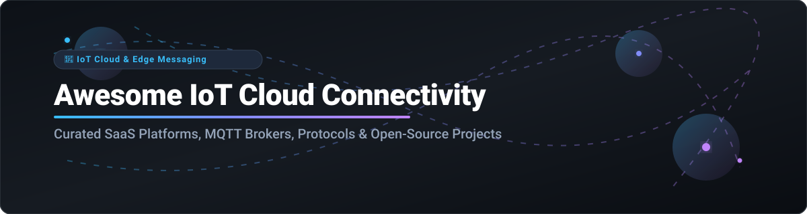

  

  
  
  
  
  

---

# 🚀 Awesome IoT Cloud Connectivity & Messaging Ecosystem

> 📡 A comprehensive, curated reference guide to **IoT Cloud Connectivity Platforms**, **Managed MQTT Brokers**, **Device Messaging Gateways**, and **Open-Source IoT Frameworks** for edge-to-cloud bidirectional messaging, telemetry streaming, device shadows, and remote device management.

---

## 📋 Table of Contents

- [📊 Market Overview & Ecosystem Dynamics](#-market-overview--ecosystem-dynamics)
- [☁️ SaaS & Managed Cloud Connectivity Platforms](#%EF%B8%8F-saas--managed-cloud-connectivity-platforms)
- [⚡ Open-Source IoT Projects & MQTT Brokers](#-open-source-iot-projects--mqtt-brokers)
- [🔍 Key Features & Comparative Summary](#-key-features--comparative-summary)
- [🤝 How to Contribute](#-how-to-contribute)
- [💖 Support & Community](#-support--community)
- [⚠️ Disclaimer & Security Considerations](#%EF%B8%8F-disclaimer--security-considerations)
- [📈 Star History](#-star-history)

---

## 📊 Market Overview & Ecosystem Dynamics

**🌐 Estimated Market Size**: The global IoT cloud connectivity and messaging market is valued at **~$10.5 Billion in 2026** and projected to reach **~$34.8 Billion by 2032** at a Compound Annual Growth Rate (CAGR) of **~22.1%**.

**🧩 Market Concentration & Fragmentation**: The sector is **moderately fragmented**. Infrastructure and cloud messaging layers are concentrated among hyperscale cloud providers (AWS, Microsoft Azure, Google Cloud). However, edge connectivity, specialized industrial IoT platforms, and lightweight/distributed MQTT messaging backbones are highly fragmented, leaving significant market share for dedicated SaaS providers (Particle, EMQX Cloud, HiveMQ, Losant) and open-source frameworks (ThingsBoard, Eclipse Mosquitto, Magistrala).

---

## ☁️ SaaS & Managed Cloud Connectivity Platforms

The table below lists top commercial SaaS and managed cloud connectivity solutions, sorted by **Company Scale / Valuation (Descending)**.

| 🏢 Platform / Vendor | 📝 Description & Key Strengths | 💰 Company Scale (Revenue / Valuation) | 💳 Starting Paid Price | 🎁 Free Tier / Free Trial Limits |
| :--- | :--- | :--- | :--- | :--- |
| **[Microsoft Azure IoT Hub](https://azure.microsoft.com/en-us/products/iot-hub/)** | Managed bidirectional cloud-to-device & device-to-cloud IoT messaging, per-device authentication, AMQP/MQTT/HTTPS support. | **~$3.1 Trillion Valuation** (~$245B Annual Revenue) | **$10.00 / month** per unit (Basic B1 Tier) | **8,000 messages/day free forever** (Free F1 Tier) + $200 Azure credit (30 days) |
| **[AWS IoT Core](https://aws.amazon.com/iot-core/)** | Hyperscale managed IoT broker, X.509 mutual authentication, Device Shadows, SQL-like rules engine, LoRaWAN routing. | **~$2.0 Trillion Valuation** (~$100B+ AWS Annual Revenue) | **$1.00 / 1M messages** ($0.08 / 1M connectivity minutes) | **2.25M message-minutes & 500k messages free/mo** for 12 months |
| **[Google Cloud IoT / Pub/Sub](https://cloud.google.com/pubsub)** | Enterprise event ingest and cloud messaging backbone for GCP IoT architectures with high throughput streaming. | **~$2.0 Trillion Valuation** (~$300B+ Alphabet Annual Revenue) | **$40.00 / TB** ($0.04 per GB) after free usage | **10 GB message data free/mo forever** + $300 GCP credit (90 days) |
| **[Particle Cloud](https://www.particle.io/)** | End-to-end IoT platform bundling cellular/Wi-Fi hardware, cloud messaging, OTA firmware updates, and fleet rules. | **~$200 Million Valuation** ($80M+ total VC funding) | **$349.00 / month** (Growth Plan for up to 1,000 devices) | **Up to 100 devices & 100,000 data ops/mo free forever** (Free Plan) |
| **[Ayla Networks](https://www.aylanetworks.com/)** | Enterprise IoT platform for consumer appliance and commercial device connectivity, automated provisioning, and telemetry analytics. | **~$150 Million Valuation** ($65M+ VC funding, ~$30M Rev) | **$500.00 / month** (Starter Enterprise Tier) | **30-day Free Trial** with developer sandbox access for up to 5 test devices |
| **[EMQX Cloud](https://www.emqx.com/en/cloud)** | Fully managed serverless & dedicated MQTT cloud broker with multi-region clustering, data integration, and 100M+ device scale. | **~$100 Million Valuation** ($50M+ VC funding, ~$15M ARR) | **$0.15 / hour** (~$108/month Serverless) / $270/mo Dedicated | **1 Million free session minutes/month free forever** + 14-day Dedicated trial |
| **[HiveMQ Cloud](https://www.hivemq.com/cloud/)** | Enterprise-grade managed MQTT messaging service built for automotive, smart manufacturing, and high-reliability IoT applications. | **~$80 Million Valuation** ($43M+ VC funding, ~$20M ARR) | **$1.50 / GB transferred** (Pay-As-You-Go Plan) | **Up to 100 connected devices & 10 GB data traffic/mo free forever** |
| **[Losant](https://www.losant.com/)** | Low-code enterprise IoT application platform featuring visual workflow engine, edge compute, and custom device dashboards. | **~$60 Million Valuation** ($20M+ VC funding, ~$15M ARR) | **$150.00 / month** (Developer / Starter Plan) | **Free Developer Sandbox** for up to 10 devices & 50,000 payload executions/mo |
| **[ThingsBoard Cloud](https://thingsboard.io/pricing/)** | Fully hosted SaaS version of ThingsBoard offering IoT device management, customizable dashboards, and real-time rule engine. | **~$30 Million Valuation** (~$10M ARR) | **$10.00 / month** (Maker Plan for up to 30 devices) | **30-day Free Trial** up to 30 devices (Self-hosted Community Edition is 100% free) |
| **[Kaa IoT Cloud](https://www.kaaiot.com/)** | Flexible enterprise IoT cloud platform offering device management, telemetry visualization, OTA updates, and microservices integration. | **~$15 Million Valuation** (~$5M ARR) | **$99.00 / month** (Startup Plan for up to 100 devices) | **Up to 5 devices free forever** (Starter Plan) + 14-day full feature trial |

---

## ⚡ Open-Source IoT Projects & MQTT Brokers

The table below lists top open-source IoT connectivity frameworks, MQTT brokers, and client libraries, sorted by **GitHub Stars (Descending)**.

| 🛠️ Project Name | ⭐ Stars Badge | 📜 License | 🎯 Primary Focus & Key Features |
| :--- | :--- | :--- | :--- |
| **[Home Assistant Core](https://github.com/home-assistant/core)** |  | Apache-2.0 | Open-source home automation platform with native MQTT integrations, local device control, and telemetry routing. |
| **[Apache Kafka](https://github.com/apache/kafka)** |  | Apache-2.0 | Distributed event streaming platform frequently paired with MQTT connectors for large-scale IoT data pipelines. |
| **[ThingsBoard](https://github.com/thingsboard/thingsboard)** |  | Apache-2.0 | Most popular open-source IoT platform offering device management, MQTT/CoAP/HTTP transport, rule engine, & dashboards. |
| **[NATS Server](https://github.com/nats-io/nats-server)** |  | Apache-2.0 | Cloud-native, high-performance pub/sub messaging system with built-in MQTT standard protocol support. |
| **[EMQX](https://github.com/emqx/emqx)** |  | BSL / Apache-2.0 | Scalable open-source distributed MQTT 5.0 broker supporting 100M+ concurrent connections with SQL rule engine. |
| **[RabbitMQ](https://github.com/rabbitmq/rabbitmq-server)** |  | MPL-2.0 | Multi-protocol message broker with official MQTT plugin enabling MQTT to AMQP bridging & enterprise queuing. |
| **[Eclipse Mosquitto](https://github.com/eclipse/mosquitto)** |  | EPL-2.0 / EDL-1.0 | Reference lightweight C-based MQTT broker for embedded gateways, single-board computers, and edge deployments. |
| **[MQTT.js](https://github.com/mqttjs/MQTT.js)** |  | MIT | Standard client library for MQTT protocol in Node.js and modern web browsers. |
| **[VerneMQ](https://github.com/vernemq/vernemq)** |  | Apache-2.0 | Distributed Erlang-based MQTT broker designed for high-availability cluster setups and low-latency messaging. |
| **[Mongoose OS](https://github.com/cesanta/mongoose-os)** |  | Apache-2.0 / Commercial | Embedded IoT firmware development framework with built-in MQTT, TLS, OTA updates, and cloud connector support. |
| **[Magistrala](https://github.com/absmach/magistrala)** |  | Apache-2.0 | Cloud-native Go-based IoT platform (formerly Mainflux) providing mTLS provisioning, fine-grained access, and multi-protocol channels. |
| **[NanoMQ](https://github.com/nanomq/nanomq)** |  | MIT | Ultra-lightweight edge MQTT broker (1.7MB footprint) built on NNG for embedded Linux and Software-Defined Vehicles. |
| **[Moquette](https://github.com/moquette-io/moquette)** |  | Apache-2.0 | Embeddable Java-based lightweight MQTT broker suitable for Android and Java enterprise applications. |
| **[Eclipse Paho Python](https://github.com/eclipse/paho.mqtt.python)** |  | EPL-2.0 / EDL-1.0 | Official Eclipse Paho Python client library for implementing MQTT 5.0 and 3.1.1 network clients. |
| **[Eclipse Paho C](https://github.com/eclipse/paho.mqtt.c)** |  | EPL-2.0 / EDL-1.0 | Standard Eclipse Paho C client library designed for embedded Linux and microcontrollers. |
| **[Aedes](https://github.com/mcollina/aedes)** |  | MIT | Fast barebone Node.js MQTT broker component designed to run inside any Node.js stream server. |
| **[EdgeX Foundry](https://github.com/edgexfoundry/edgex-go)** |  | Apache-2.0 | Modular open-source IoT edge platform framework hosted by LF Edge for industrial edge computing. |
| **[Kaa IoT Platform](https://github.com/kaaproject/kaa)** |  | Apache-2.0 | Microservices-based enterprise IoT platform core for Kubernetes deployments, device management, and OTA. |
| **[Eclipse Paho C++](https://github.com/eclipse/paho.mqtt.cpp)** |  | EPL-2.0 / EDL-1.0 | Modern C++ wrapper client library for Eclipse Paho C MQTT implementation. |
| **[HiveMQ Community Edition](https://github.com/hivemq/hivemq-community-edition)** |  | Apache-2.0 | Java-based open-source MQTT broker supporting MQTT 3.x and MQTT 5.0 protocol specifications. |
| **[openHAB Core](https://github.com/openhab/openhab-core)** |  | EPL-2.0 | Core Java framework powering openHAB home automation system with extensive MQTT bindings. |
| **[Mainflux (Archived)](https://github.com/mainflux/mainflux)** |  | Apache-2.0 | Legacy Go-based industrial IoT messaging platform, now succeeded by the Magistrala project. |

---

## 🔍 Key Features & Comparative Summary

When choosing an IoT cloud connectivity platform or MQTT broker, evaluate:

1. 📡 **Protocol Support**: MQTT 5.0, MQTT-SN, CoAP, HTTP/2, WebSockets, AMQP, LoRaWAN.
2. 🔐 **Security & Auth**: X.509 mutual TLS (mTLS) certificate authentication, OAuth 2.0, fine-grained access control (RBAC), and per-device tokens.
3. 🏗️ **Deployment Model**:
   - **Hyperscaler SaaS** (AWS IoT Core, Azure IoT Hub): Best for serverless scalability and native cloud integration.
   - **Specialized Managed MQTT** (EMQX Cloud, HiveMQ Cloud): Best for pure MQTT protocol compliance, high throughput, and multi-cloud flexibility.
   - **Self-Hosted Open Source** (Mosquitto, EMQX, ThingsBoard, Magistrala): Best for data sovereignty, custom edge/on-prem deployments, and avoiding vendor lock-in.

---

## 🤝 How to Contribute

1. 🍴 Fork this repository.
2. ✏️ Update `README.md` following the tabular schema.
3. 🚀 Submit a Pull Request detailing the product/project, licensing, and pricing/star updates.

---

## 💖 Support & Community

If you found this curated IoT Cloud Connectivity & Messaging list useful:
- ⭐ **Star this repository** on GitHub to show support!
- 🍴 **Fork it** to customize your own IoT technology stack matrix.
- 📢 **Share it** with fellow IoT engineers, embedded developers, and cloud architects.
- ☕ **Buy me a coffee**: Support ongoing maintenance via the [GitHub Sponsors Dashboard](https://github.com/sponsors/ishandutta2007).

---

## ⚠️ Disclaimer & Security Considerations

- 📌 This list is community-curated for informational purposes.
- 🛡️ IoT device connectivity handles sensitive physical credentials and telemetry. Ensure strong TLS encryption and access security when deploying IoT messaging brokers.

---

## 📈 Star History

